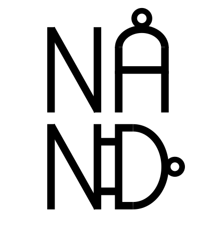

    

<b>N</b> ot\
<b>A</b> \
<b>N</b> and-powered\
<b>D</b> evice\
\
is a turing equivalent computer entirely built from a clock and NAND logic gates. NAND features its own machine code language, assembly language, assembler, VM language, VM translator, programming language, compiler, and IDE. NAND is based on the Jack-VM-Hack platform specified in the [Nand to Tetris course](https://www.nand2tetris.org).
\
\
Here is a technical breakdown of the technologies used to build NAND:
* Logic simulator: Rust on Web Workers
* Assembler, VM translator, compiler, and IDE: TypeScript
* NAND's Example programs: Jack (NAND's programming language) utilizing JavaScript to help with debugging
* Frontend: Svelte with Vite