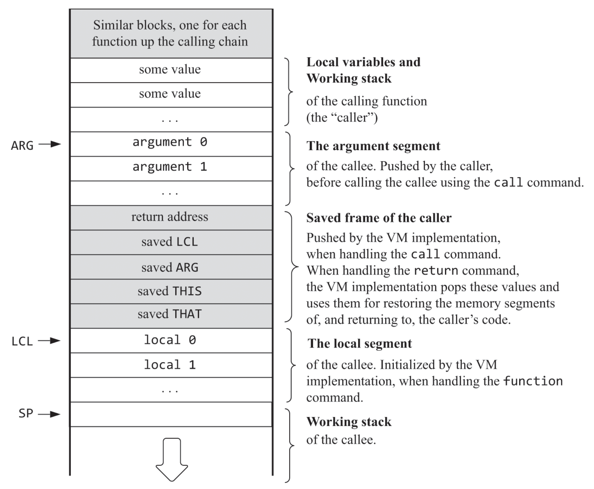

<p align="center">
    
</p>
<hr>
<!-- cSpell:disable -->

<b>N</b> ot\
<b>A</b> \
<b>N</b> and-powered\
<b>D</b> evice
<!-- cSpell:enable -->
is a turing equivalent 16-bit computer made entirely from a [clock](https://en.wikipedia.org/wiki/Clock_rate) and [NAND gates](https://en.wikipedia.org/wiki/NAND_gate). NAND features its own machine code language, assembly language, assembler, virtual machine language, virtual machine translator, programming language, compiler, IDE, and user interface. NAND is based on the Jack-VM-Hack platform specified in the [Nand to Tetris course](https://www.nand2tetris.org).

[Video demo of NAND](https://github.com/ArhanChaudhary/NAND/assets/57512390/7bedf191-d42c-4553-920f-01a539161bd3)

### Table of Contents

- [Example programs](#example-programs)
    - [Average](#average)
    - [Pong](#pong)
    - [2048](#2048)
    - [Overflow](#overflow)
    - [SecretPassword](#secretpassword)
    - [GeneticAlgorithm](#geneticalgorithm)
- [Writing programs for NAND](#writing-programs-for-nand)
    - [Jack Introduction](#jack-introduction)
    - [Custom Data Types](#custom-data-types)
    - [Weak Type Coercions](#weak-type-coercions)
    - [Manual Memory Management](#manual-memory-management)
    - [Undefined Behavior](#undefined-behavior)
    - [Hardware Specification](#hardware-specification)
    - [Beyond the Jack OS](#beyond-the-jack-os)
- [Jack Reference](#jack-reference)
    - [Program structure](#program-structure)
    - [Syntax](#syntax)
    - [Variables](#variables)
    - [Statements](#statements)
- [Jack OS Reference](#jack-os-reference)
    - [Array](#array)
    - [Keyboard](#keyboard)
    - [Math](#math)
    - [Memory](#memory)
    - [Output](#output)
    - [Screen](#screen)
    - [String](#string)
    - [Sys](#sys)
    - [Error Codes](#error-codes)
- [How does NAND work?](#how-does-nand-work)
- [FAQ](#faq)
    - [Whoa, is *everything* made from NAND gates?](#whoa-is-everything-made-from-nand-gates)
    - [Did you design NAND by yourself?](#did-you-design-nand-by-yourself)
    - [If there's only one type, what is the point of specifying types at all?](#if-theres-only-one-type-what-is-the-point-of-specifying-types-at-all)
    - [Why does the IDE feel finnicky?](#why-does-the-ide-feel-finnicky)

# Example programs

### Average

A simple program that inputs some numbers and computes their average, showing off control flow, arithmetic operations, I/O, and dynamic memory allocation.

Example program output:
```
How many numbers? 4
Enter a number: 100
Enter a number: 42
Enter a number: 400
Enter a number: 300
The average is 210
```
*This program was supplied by the Nand to Tetris software suite.*

### Pong

A program that runs the game of Pong, showing off the language's object-oriented model. Use the arrow keys to move the paddle left and right to bounce a ball. Every bounce, the paddle becomes smaller, and the game ends when the ball hits the bottom of the screen.

*This program was supplied by the Nand to Tetris software suite.*

### 2048

A program that runs the game of the game of 2048, showing off recursion and complex application logic. Use the arrow keys to move the numbers around the 4x4 grid. Two numbers that move into each other combine into their sum. You lose the game when you can't make any more moves. Once the 2048 tile is reached, you win the game, though you can keep playing on until you lose.

### Overflow

A program that deliberately causes a stack overflow via infinite recursion to perform a [virtual machine escape](https://en.wikipedia.org/wiki/Virtual_machine_escape). It leverages the fact that there are no runtime checks to prevent a stack overflow. No other modern platform will let you do this :-)

Upon running, the program will constantly print the stack pointer to the screen. Once this displayed value exceeds 2048, the stack will have reached the end of its intended memory space and spill onto the heap memory space, causing the print statement to malfunction in explosive fashion:


Two things of noteworthy interest are worth pointing out.

If you reload the page and run this program on an empty RAM (a RAM full of zeroes), you will notice that the program resets itself halfway through its execution despite not pressing the "Reset" button. Why this happens is simple: the jailbroken runtime executes an instruction that sets the [program counter](https://en.wikipedia.org/wiki/Program_counter)'s value to 0, effectively telling the program to start over at the first instruction.

If you run the GeneticAlgorithm example program and then run this immediately afterwards, interestingly enough, the program reads the old RAM memory that was simply never overwritten.


### SecretPassword

A program that exploits the fact that the runtime doesn't prevent [stack smashing](https://en.wikipedia.org/wiki/Stack_buffer_overflow) to call a function that would otherwise be inaccessible. In order to understand how this works, let's examine this illustration of NAND's stack frame layout.



*taken from the [Nand to Tetris book](https://www.amazon.com/Elements-Computing-Systems-second-Principles-dp-0262539802/dp/0262539802/ref=dp_ob_title_bk).*

If you're unfamiliar with stack layouts, here's the main idea behind the exploit. Whenever a function returns, it needs to know where (which machine code instruction memory address) it should go to proceed with execution flow. So, when the function is first called, this memory address, along with some other unimportant data, is temporarily stored on the stack in a memory region referred to as the [stack frame](https://en.wikipedia.org/wiki/Call_stack#STACK-FRAME). The illustration describes the exact position of this return address relative to the function call, a position that can be reverse engineered.

The program enables the user to set a single memory address in the RAM to any value. Putting two and two together, if the user were to overwrite the return address of a stack frame with the location of another function in the instruction memory, they essentially gain the ability to execute arbitrary code included in the machine code binary.

Indeed, if you enter 267 as the memory location and 1715 as the value to overwrite, two numbers reverse engineered by manually inspecting the stack memory space and the assembler, you'll see this idea in working action.


This isn't a vulnerability unique to NAND. It exists in C as well! How cool!

### GeneticAlgorithm

Believe it or not, out of the many, *many* different components of NAND, this program single-handedly took the longest to develop!

There are an incredible amount of unique optimization techniques I used to

# Writing programs for NAND

**Before we start, the most important detail to remember about writing programs in Jack is that there is no operator priority; this is probably why your program isn't working.**

For example, you should change: \
`4 * 2 + 3` to `(4 * 2) + 3` \
`if (~x & y)` to `if ((~x) & y)`

but you can keep `if (y & ~x)` the same as there is no operator ambiguity.

Without parenthesis, the evaluation value of an ambiguous expression is **undefined behavior**.

### Jack Introduction

NAND boasts its own complete tech stack. As a consequence, NAND can only be programmed in Jack, its weakly typed object-oriented programming language. In layman's terms, Jack is C with Java's syntax and without types.

Let's take the approach of example-based learning and dive right in.

```js
/**
 * This program prompts the user to enter a phrase
 * and an energy level. Example program output:
 *
 * Whats on your mind? Superman
 * Whats your energy level? 3
 * Superman!
 * Superman!
 * Superman!
 */
class Main {
    function void main() {
        var String s;
        var int energy, i;
        let s = Keyboard.readLine("Whats on your mind? ");
        let energy = Keyboard.readInt("Whats your energy level? ");
        let i = 0;
        let s = s.appendChar(33); // Appends the character '!'
        while (i < energy) {
            do Output.printString(s);
            do Output.println();
            let i = i + 1;
        }
    }
}
```
*taken from the [Nand to Tetris lecture slides](https://drive.google.com/file/d/1CAGF8d3pDIOgqX8NZGzU34PPEzvfTYrk/view).*

If you've already had some experience with programming, this should look very familiar; it is clear that Jack was heavily inspired by Java. `Main.main` is the entry point to the program. The function demonstrates basic usage of variables as well as the while loop for control flow. Additionally, it uses `Keyboard.readLine` and `Keyboard.readInt` to read input from the user, and `Output.printString` and `Output.println` to render output to the screen, all of which are defined in detail in the [Jack OS Reference](#jack-os).

### Custom Data Types

Every programming language has a fixed set of primitive data types. Jack supports three: `int`, `char`, and `boolean`. You can extend this basic repertoire with your own abstract data types by creating new classes as needed.
// point stuff, mention deallocating memory, private variables

```js
class Foo {
    ...
    method void f() {
        var Bar b; // Declares a local variable of class type Bar
        var int i; // Declares a local variable of primitive type int

        do g(); // Calls method g of the current class on the this object
                // Note: Cannot be called from within a function (static method)

        do Foo.p(3); // Calls function p of the current class;
                     // Note: A function call must be preceded by the class name

        do Bar.h();      // Calls function h of class Bar
        let b = Bar.r(); // Calls function or constructor r of class Bar
        do b.q();        // Calls method q of class Bar on the b object
    }
}
```
*taken from the [Nand to Tetris lecture slides](https://drive.google.com/file/d/1CAGF8d3pDIOgqX8NZGzU34PPEzvfTYrk/view).*

### Weak Type Coercions

Remember how we said Jack was similar to Java? That was a facade, or at best misleading. While Java is strongly-typed and as such supports complex type features such as down casting, polymorphism, and inheritance, Jack supports none of these and only has one type under the hood: the signed 16-bit integer. This is the primary reason why Jack is so weakly-typed. In effect, the compiler won't care if you mix and match different types in assignments and operations.

```js
var char c;
var String s;
let c = 65; // 'A'
// Equivalently
let s = “A”;
let c = s.charAt(0);
```
```js
var Array a;
let a = 5000;
let a[100] = 77; // RAM[5100] = 77
```
```js
var Array arr;
var String helloWorld;
let helloWorld = "Hello World!"
let arr = Array.new(4); // Arrays are not strictly typed
let arr[0] = 12;
let arr[1] = false;
let arr[2] = Point.new(5, 6);
let arr[3] = helloWorld;
```
```js
class Complex {
    field int real;
    field int imaginary;
    ...
}
...
var Complex c;
var Array a;
let a = Array.new(2);
let a[0] = 7;
let a[1] = 8;
let c = a; // c == Complex(7, 8)
           // Works because it matches the memory layout
           // of the Complex type
```
*all code segments taken from the [Nand to Tetris lecture slides](https://drive.google.com/file/d/1CAGF8d3pDIOgqX8NZGzU34PPEzvfTYrk/view).*

Don't take this the wrong way — Jack still provides a powerful and functional object-oriented model. This insight intends to help you understand when and how you should perform type conversions as needed.

### Manual Memory Management

Let's say you're a crazy cat lover, just like me! And you wanted to write this program to show off just how much you absolutely adore cats.
```js
class Main {
    function void main() {
        while (true) {
          do Output.printString("Kittens are so adorable! ");
        }
    }
}
```
You may be startled to notice that after a few seconds, the program will crash with "ERR6", or a [heap overflow](https://en.wikipedia.org/wiki/Heap_overflow)!

Jack is a [manually memory managed](https://en.wikipedia.org/wiki/Manual_memory_management) programming language. This means you have to be vigilant with properly deallocating memory that is no longer needed, or else the Jack OS will think otherwise and facilitate a [memory leak](https://en.wikipedia.org/wiki/Memory_leak). The best practice advice is to feature a `dispose` method for each class that represents an object that properly encapsulates this deallocation. Thus, when objects are no longer needed, you can call their `dispose` methods to ensure you won't eventually run out of heap memory.

If you've programmed in other manually memory managed languages, like C, this should look very familiar. One key difference is the Jack OS stores arrays and strings on the heap rather than on the stack, hinting to why the program crashes with a heap overflow.

Let's fix this program for our fellow feline fanatics.
```js
class Main {
    function void main() {
        var String s;
        while (true) {
            let s = "Kittens are so adorable! ";
            do Output.printString(s);
            do s.dispose();
        }
    }
}
```
Alternatively, you could allocate memory for the string only once.
```js
class Main {
    function void main() {
        var String s;
        let s = "Kittens are so adorable! ";
        while (true) {
            do Output.printString(s);
        }
    }
}
```
You'll notice that not only do these alternative versions print the string much faster, but this time they'll actually print forever! Hooray!

Let's quickly peek into `String.dispose` so you can better understand how to write your own `dispose` methods.

```js
method void dispose() {
    do stringArray.dispose();
    do Memory.deAlloc(this);
}
```
`Array.dispose` called by `stringArray`
```js
method void dispose() {
    do Memory.deAlloc(this);
}
```
Proper `dispose` methods must first appropriately call `dispose` on their field variables and then end with `do Memory.deAlloc(this);` to deallocate the object instance itself.

### Undefined Behavior

With how primitive Jack and NAND are, footguns within the language are inevitable. To my knowledge, the following is a list of all undefined behavior that you should look out for, ordered from (in my opinion) most important to least important.

- operator priority
- < and > (compatibility reasons)
- -32768 is a funny number. It is the only one that holds the property such that -(-32768) = -32768. In other words, it a singleton without a positive counterpart, and this has consequences. `Math.abs` is one such victim of its behavior.
- modifying stack frame
- too few arguments (mention it is a won't fix), too many: arguments keyword in docs (nArgs doesn't matter)
- stack overflows
- modifying registers

### Hardware Specification

//max ROM 32768 and max static 240 and max stack 1792 and screen stuff


*taken from the [Nand to Tetris lecture slides](https://drive.google.com/file/d/1BexrNmdqYhKPkqD_Y81qNAUeyfzl-ZtO/view).*

Lastly, NAND's keyboard recognizes all ASCII characters, as well as the following keys.
 * new line = 128 = `String.newline()`
 * backspace = 129 = `String.backspace()`
 * left arrow = 130
 * up arrow = 131
 * right arrow = 132
 * down arrow = 133
 * home = 134
 * end = 135
 * page up = 136
 * page down = 137
 * insert = 138
 * delete = 139
 * ESC = 140
 * F1 - F12 = 141 - 152

The currently pressed key is reflected at RAM address 24576. Though, you shouldn't directly access this location to handle user input. You should use the provided [Keyboard](#keyboard) class from the Jack OS and its associated functions.

### Beyond the Jack OS

By default, the Jack OS is bundled with your program during compilation to enable interfacing with strings, memory, hardware, and more. To the extraordinarily dedicated, it is possible to provide your own OS with your own hardware interfaces. There are a few core functions you *must* implement if you choose to do so.

`Sys.init`: The *real* entry point of the program, hardcoded in the virtual machine implementation. In the current Jack OS, This function initializes

# Jack Reference

This majority of this section was taken from the [Nand to Tetris lecture slides](https://drive.google.com/file/d/1CAGF8d3pDIOgqX8NZGzU34PPEzvfTYrk/view) and the [National Taiwan University lecture slides](https://www.csie.ntu.edu.tw/~cyy/courses/introCS/18fall/lectures/handouts/lec13_Jack.pdf).

### Program structure

<pre>
<b>class</b> ClassName {
    <b>field</b> <i>variable declarations</i>;
    <b>static</b> <i>variable declarations</i>;

    <b>constructor</b> <i>type</i> ( <i>parameterList</i> ) {
        <i>local variable declarations</i>;
        <i>statements</i>
    }

    <b>method</b> <i>type</i> ( <i>parameterList</i> ) {
        <i>local variable declarations</i>;
        <i>statements</i>
    }

    <b>function</b> <i>type</i> ( <i>parameterList</i> ) {
        <i>local variable declarations</i>;
        <i>statements</i>
    }
}
</pre>

About this layout:
- Every part in this layout can appear 0 or more times
- The order of the field / static
declarations is arbitrary
- The order of the subroutine declarations is arbitrary
- Each type is either `void`, `int`, `boolean`, `char`, or a class name

A Jack program:
- Defines classes in separate files
- Consists of a collection of one or more classes, one of which must be named `Main`
- Must define the `main` function in the `Main` class, the entry point of the program defined by the Jack OS.

### Syntax

<table>
  <tbody>
    <tr>
      <th>White space and comments</th>
      <td>
        Space characters, newline characters, and comments are ignored.<br>
        <br>
        The following comment formats are supported:<br>
        <code>// Comment to end of line</code><br>
        <code>/* Comment until closing */</code><br>
        <code>/** API documentation comment */</code>
      </td>
    </tr>
    <tr>
      <th>Symbols</th>
      <td>
        <table>
          <tbody>
            <tr>
              <th align="left">
                <code>(</code>&nbsp;<code>)</code>
              </th>
              <td>
                Used for grouping arithmetic expressions and for enclosing parameter-lists and argument-lists
              </td>
            </tr>
            <tr>
              <th align="left">
                <code>[</code>&nbsp;<code>]</code>
              </th>
              <td>
                Used for array indexing
              </td>
            </tr>
            <tr>
              <th align="left">
                <code>{</code>&nbsp;<code>}</code>
              </th>
              <td>
                Used for grouping program units and statements
              </td>
            </tr>
            <tr>
              <th align="left">
                <code>,</code>
              </th>
              <td>
                Variable list separator
              </td>
            </tr>
            <tr>
              <th align="left">
                <code>;</code>
              </th>
              <td>
                Statement terminator
              </td>
            </tr>
            <tr>
              <th align="left">
                <code>.</code>
              </th>
              <td>
                Class membership
              </td>
            </tr>
            <tr>
              <th align="left">
                <code>=</code>
              </th>
              <td>
                Assignment and comparison operator
              </td>
            </tr>
            <tr>
              <th>
                <code>+</code>&nbsp;<code>-</code>&nbsp;<code>*</code><br>
                <code>/</code>&nbsp;<code>&</code>&nbsp;<code>|</code><br>
                <code>-</code>&nbsp;<code><</code>&nbsp;<code>></code>
              </th>
              <td>
                Operators. Note that <code>&</code> and <code>|</code> do not short-circuit
              </td>
            </tr>
          </tbody>
        </table>
      </td>
    </tr>
    <tr>
      <th>Reserved words</th>
      <td>
        <table>
          <tbody>
            <tr>
              <th align="left">
                <code>class</code>,
                <code>constructor</code>,
                <code>method</code>,
                <code>function</code>
              </th>
              <td>
                Program components
              </td>
            </tr>
            <tr>
              <th align="left">
                <code>int</code>,
                <code>boolean</code>,
                <code>char</code>
              </th>
              <td>
                Primitive types
              </td>
            </tr>
            <tr>
              <th align="left">
                <code>var</code>,
                <code>static</code>,
                <code>field</code>
              </th>
              <td>
                Variable declarations
              </td>
            </tr>
            <tr>
              <th align="left">
                <code>let</code>,
                <code>do</code>,
                <code>if</code>,
                <code>else</code>,
                <code>while</code>,
                <code>return</code>
              </th>
              <td>
                Statements
              </td>
            </tr>
            <tr>
              <th align="left">
                <code>true</code>,
                <code>false</code>,
                <code>null</code>
              </th>
              <td>
                Constant values (-1. 0, and 0 respectively)
              </td>
            </tr>
            <tr>
              <th align="left">
                <code>this</code>
              </th>
              <td>
                Object reference
              </td>
            </tr>
            <tr>
              <th align="left">
                <code>arguments</code>
              </th>
              <td>
                Subroutine arguments array reference
              </td>
            </tr>
          </tbody>
        </table>
      </td>
    </tr>
    <tr>
      <th>Constants</th>
      <td>
          <i>Integer</i> constants must be positive and in standard decimal notation, e.g., <code>1984</code>. Negative integers like <code>-13</code> are not constants but rather expressions consisting of a unary minus operator applied to an integer constant.<br>
          <br>
          <i>String</i> constants are enclosed within quotation marks and may contain any characters except new lines or quotation marks. Unlike typical programming languages, these characters cannot be escaped within a string, so these characters are instead supplied by the functions <code>String.newLine()</code> and <code>String.doubleQuote()</code> from the OS<br>
          <br>
          <i>Boolean</i> constants can be true or false.<br>
          <br>
          The constant null signifies a null reference (a value of 0).
      </td>
    </tr>
  <tr>
    <th>Identifiers</th>
    <td>
        Identifiers are composed from arbitrarily long sequences of letters
        (<code>A-Z</code>, <code>a-z</code>), digits (<code>0-9</code>), and "_". The first character must be a letter or "_".<br>
        <br>
        Case sensitivity matters. Thus <code>x</code> and <code>X</code> are treated as different identifiers.
    </td>
  </tr>
  </tbody>
</table>

### Variables

| Variable kind       | Description                                                                                                                                                                                          | Declared in            | Scope                                                                                 |
| ------------------- | ---------------------------------------------------------------------------------------------------------------------------------------------------------------------------------------------------- | ---------------------- | ------------------------------------------------------------------------------------- |
| static variables    | `static` *type varName1, varName2, ...*;<br>Only one copy of each static variable exists, and this copy is shared by all the object instances of the class (like *private static variables* in Java) | class declaration      | The class in which they are declared.                                                 |
| field variables     | `field` *type varName1, varName2, ...*;<br>Every object (instance of the class) has a private copy of the field variables (like *member variables* in Java)                                          | class declaration      | The class in which they are declared, except for functions, where they are undefined. |
| local variables     | `var` *type varName1, varName2, ...*;<br>Local variables are created just before the subroutine starts running and are deallocated when it returns (like *local variables* in Java)                  | subroutine declaration | The subroutine in which they are declared.                                            |
| parameter variables | *type varName1, varName2, ...*<br>Used to pass arguments to the subroutine. Treated like local variables whose values are initialized "from the outside", just before the subroutine starts running. | subroutine signature   | The subroutine in which they are declared.                                            |

### Statements

| Statement | Syntax                                                                                                                                                                                      | Description                                                                                                                                   |
| --------- | ------------------------------------------------------------------------------------------------------------------------------------------------------------------------------------------- | --------------------------------------------------------------------------------------------------------------------------------------------- |
| let       | `let` *varName = expression*;<br>or<br>`let` *varName*[*expression1*] = *expression2*;                                                                                                      | An assignment operation (where *varName* is either single-valued or an array). The variable kind may be *static, local, field, or parameter*. |
| if        | `if` (expression1) {<br>&nbsp;&nbsp;&nbsp;&nbsp;statements1<br>} `else if` (expression2) {<br>&nbsp;&nbsp;&nbsp;&nbsp;statements2<br>} `else` {<br>&nbsp;&nbsp;&nbsp;&nbsp;statements3<br>} | Typical *if* statement with an optional *else* or *else if* clause. The brackets are optional if there's only one statement.                  |
| while     | `while` (expression) {<br>&nbsp;&nbsp;&nbsp;&nbsp;*statements*<br>}                                                                                                                         | Typical *while* statement. The brackets are optional if there's only one statement.                                                           |
| do        | `do` *function-or-method-call*;                                                                                                                                                             | Used to call a function or a method for its effect, ignoring the returned value.                                                              |
| return    | `return` expression;<br>or<br>`return`;                                                                                                                                                     | Used to return a value from a subroutine. Constructors must return the expression `this`.                                                     |

# Jack OS Reference

This section was adapted from the supplied Nand to Tetris software suite.

### Array

```js
/**
 * Represents an array.
 * In the Jack language, arrays are instances of the Array class.
 * Once declared, the array entries can be accessed using the usual
 * syntax arr[i]. Each array entry can hold a primitive data type as
 * well as any object type. Different array entries can have different
 * data types.
 */
class Array {
    /**
     * Constructs a new array of the given size.
     */
    function Array new(int size);

    /**
     * Deallocates an instance of Array and frees its memory space.
     */
    method void dispose();
}
```

### Keyboard

```js
/**
 * The Keyboard class provides an interface for reading inputs from
 * a standard keyboard.
 */
class Keyboard {
    /**
     * Returns the character code of the currently pressed key,
     * or 0 if no key is currently pressed.
     */
    function char keyPressed();

    /**
     * Waits until a keyboard key is pressed and released, then displays the
     * corresponding character on the screen and returns the character.
     */
    function char readChar();

    /**
     * Prints the message on the screen, reads the next line (until a newLine
     * character) from the keyboard, and returns its value.
     */
    function String readLine(String message);

    /**
     * Prints the message on the screen, reads the next line (until a newline
     * character) from the keyboard, and returns its integer value (until the
     * first non numeric character).
     */
    function int readInt(String message);
}
```

### Math

```js
/**
 * A library of commonly used mathematical functions.
 */
class Math {
    /**
     * Returns the absolute value of x.
     */
    function int abs(int x);

    /**
     * Returns the product of x and y.
     * This function is internally called in lieu of the multiplication
     * operator '*'. In other words, the Jack expression x * y and
     * Math.multiply(x, y) are equivalent.
     */
    function int multiply(int x, int y);

    /**
     * Returns the integer part of x / y.
     * This function is internally called in lieu of the division
     * operator '/'. In other words, the Jack expression x / y and
     * Math.divide(x, y) are equivalent.
     */
    function int divide(int dividend, int divisor);

    /**
     * Returns the integer part of the square root of x.
     */
    function int sqrt(int x);

    /**
     * Returns the greater of the two arguments.
     */
    function int max(int a, int b);

    /**
     * Returns the smaller of the two arguments.
     */
    function int min(int a, int b);
}
```

### Memory

```js
/**
 * This library provides two services: direct access to the computer's main
 * memory (RAM), and allocation and recycling of memory blocks. The NAND RAM
 * consists of 32,768 words, each holding a 16-bit binary number.
 */
class Memory {
    /**
     * Returns the RAM value at the given address.
     */
    function int peek(int address);

    /**
     * Sets the value of the given RAM address to the given value.
     */
    function void poke(int address, int value);

    /**
     * Finds and allocates from the heap a memory block of the specified size and
     * returns a reference to its base address.
     */
    function int alloc(int size);

    /**
     * Deallocates the given object (cast as an array) by making it available for
     * future allocations.
     */
    function void deAlloc(Array o);
}
```

### Output

```js
/**
 * A library of functions for writing text on the screen.
 * The NAND physical screen consists of 512 rows of 256 pixels each.
 * The library uses a fixed font, in which each character is displayed
 * within a frame which is 11 pixels high (including 1 pixel for inter-line
 * spacing) and 8 pixels wide (including 2 pixels for inter-character spacing).
 * The resulting grid accommodates 23 rows (indexed 0..22, top to bottom)
 * of 64 characters each (indexed 0..63, left to right). The top left
 * character position on the screen is indexed (0,0). A cursor, implemented
 * as a small filled square, indicates where the next character will be displayed.
 */
class Output {
    /**
     * Moves the cursor to the j'th column of the i'th row, erasing the character
     * that was there.
     */
    function void moveCursor(int i, int j);

    /**
     * Displays the given character at the cursor location,
     * and advances the cursor one column forward.
     */
    function void printChar(char c);

    /**
     * Displays the given string starting at the cursor location, and advances
     * the cursor appropriately.
     */
    function void printString(String str);

    /**
     * Displays the given integer starting at the cursor location, and advances
     * the cursor appropriately.
     */
    function void printInt(int i);

    /**
     * Advances the cursor to the beginning of the next line.
     */
    function void println();

    /**
     * Erases the character that was last written and moves the cursor one column
     * back.
     */
    function void backSpace();
}
```

### Screen

```js
/**
 * A library of functions for displaying graphics on the screen.
 * The NAND physical screen consists of 256 rows (indexed 0..255, top to bottom)
 * of 512 pixels each (indexed 0..511, left to right). The top left pixel on
 * the screen is indexed (0,0).
 */
class Screen {
    /**
     * Erases the entire screen.
     */
    function void clearScreen();

    /**
     * Sets the current color to be used for all subsequent drawXXX commands.
     * Black is represented by true, white by false.
     */
    function void setColor(boolean b);

    /**
     * Draws the (x, y) pixel using the current color.
     */
    function void drawPixel(int x, int y);

    /**
     * Draws a line from pixel (x1, y1) to pixel (x2, y2) using the current color.
     */
    function void drawLine(int x1, int y1, int x2, int y2);

    /**
     * Draws a filled rectangle whose top left corner is (x1, y1) and bottom
     * right corner is (x2, y2) using the current color.
     */
    function void drawRectangle(int x1, int y1, int x2, int y2);

    /**
     * Draws a filled circle of radius r <= 181 around (x, y) using the current
     * color.
     */
    function void drawCircle(int x, int y, int r);
}
```

### String

```js
/**
 * Represents character strings. In addition for constructing and
 * deallocating strings, the class features methods for getting and setting
 * individual characters of the string, for erasing the string's last character,
 * for appending a character to the string's end, and more typical
 * string-oriented operations.
 */
class String {
    /**
     * Constructs a new empty string with a maximum length of maxLength and
     * initial length of 0.
     */
    constructor String new(int maxLength);

    /**
     * Deallocates an instance of String and frees its memory space.
     */
    method void dispose();

    /**
     * Returns the current length of an instance of String.
     */
    method int length();

    /**
     * Returns the character at the j-th location of an instance of String.
     */
    method char charAt(int j);

    /**
     * Sets the character at the j-th location of an instance of String to c.
     */
    method void setCharAt(int j, char c);

    /**
     * Appends the given character to the end of an instance of String and
     * returns the same instance.
     */
    method String appendChar(char c);

    /**
     * Erases the last character from an instance of String.
     */
    method void eraseLastChar();

    /**
     * Returns the integer value of an instance of String until the first
     * non-numeric character.
     */
    method int intValue();

    /**
     * Sets an instance of String to the representation of the given number.
     */
    method void setInt(int number);

    /**
     * Returns the new line character.
     */
    function char newLine();

    /**
     * Returns the backspace character.
     */
    function char backSpace();

    /**
     * Returns the quotation mark character.
     */
    function char doubleQuote();
}
```

### Sys

```js
/**
 * A library that supports various program execution services.
 */
class Sys {
    /**
     * Halts the program execution.
     */
    function void halt();

    /**
     * Displays the given error code in the format "ERR[errorCode]", and halts
     * the program's execution.
     */
    function void error(int errorCode);

    /**
     * Waits approximately duration milliseconds and returns. Note that this is
     * runtime dependent and may not be accurate.
     */
    function void wait(int duration);
}
```

### Error Codes

If you do something that forces the computer into an invalid state, like computing the result of `1 / 0`, the Jack OS will display one of these error codes in the format of "ERR[N]" and immediately terminate the program.

| Code | Method/Function      | Description                                     |
| ---- | -------------------- | ----------------------------------------------- |
| 1    | Sys.wait             | Duration must be positive                       |
| 2    | Array.new            | Array size must be positive                     |
| 3    | Math.divide          | Division by zero                                |
| 4    | Math.sqrt            | Cannot compute square root of a negative number |
| 5    | Memory.alloc         | Allocated memory size must be positive          |
| 6    | Memory.alloc         | Heap overflow                                   |
| 7    | Screen.drawPixel     | Illegal pixel coordinates                       |
| 8    | Screen.drawLine      | Illegal line coordinates                        |
| 9    | Screen.drawRectangle | Illegal rectangle coordinates                   |
| 12   | Screen.drawCircle    | Illegal center coordinates                      |
| 13   | Screen.drawCircle    | Illegal radius                                  |
| 14   | String.new           | Maximum length must be non-negative             |
| 15   | String.charAt        | String index out of bounds                      |
| 16   | String.setCharAt     | String index out of bounds                      |
| 17   | String.appendChar    | String is full                                  |
| 19   | String.setInt        | Insufficient string capacity                    |
| 20   | Output.moveCursor    | Illegal cursor location                         |

# How does NAND work?

I'm glad you asked! I've found the following [illustrations](https://en.wikipedia.org/wiki/Hack_computer) quite illuminating:


The NAND computer follows the [Harvard architecture](https://en.wikipedia.org/wiki/Harvard_architecture). That is, the instruction memory (ROM) and the data memory (RAM) are separately stored, brought function in unison by the CPU.


NAND's CPU is an [accumulator machine](https://en.wikipedia.org/wiki/Accumulator_(computing)#Accumulator_machines), meaning that it is heavily dependent on its built-in registers for control flow (in this case the accumulator is the D register). Don't worry if you don't fully understand what the CPU visualization depicts. Instead, take the perspective of appreciation for how this elegantly simple design powers the entirety of NAND — in your web browser!


We've reached the instruction set, the nitty-gritty. As indicated, NAND's CPU only has *two* opcodes! This makes the instruction set relatively simple while providing a rich functionality. NAND's ALU is also specified with which expressions it can compute in a single instruction.

Phew! That was a lot to take in, but I promise you NAND is far less complicated than it's made out to be. From a relatively simple logical foundation, turing equivalence is achieved! If you want see my implementation of the NAND computer architecture, [you're more than welcome to](src/core)! If you find yourself still curious, check out the [Nand to Tetris lecture slides](https://drive.google.com/file/d/1Z_fxYmmRNXTkAzmZ6YMoX9NXZIRVCKiw/view) for further elaboration on every aspect of its design.

Let's just briefly talk about the compiler to make this section feel complete. Some of NAND's strange syntactical features are a direct consequence of making the compiler easier to implement. The compiler is a [recursive LL(1) parser](https://en.wikipedia.org/wiki/LL_parser), generating virtual machine code in [postfix notation](https://en.wikipedia.org/wiki/Reverse_Polish_notation) to be utilized as a [simple stack machine](https://en.wikipedia.org/wiki/Stack_machine). Once again, you're more than welcome to see my [compiler implementation](src/compiler) for yourself.

# FAQ

### Whoa, is *everything* made from NAND gates?

Well..., I admit the description and title are a little misleading, but still in good faith. The compiler and virtual machine translator are written in Typescript, and the kernel and hardware are emulated in Rust. It's only really the logic simulator that runs every computation, screen rendering operation, and memory access entirely from NAND gates. Bootstrapping the full tech stack is a feat that isn't unheard of, but such a massive project by itself probably deserves its own repository.

### Did you design NAND by yourself?

NAND is entirely based off of the [Nand to Tetris course](https://www.nand2tetris.org) and its [associated book](https://www.amazon.com/Elements-Computing-Systems-second-Principles-dp-0262539802/dp/0262539802/ref=dp_ob_title_bk) (and you should definitely check it out, it's an absolutely incredible read). I solely implemented the specification for CPU, assembler, virtual machine translator, and compiler, while porting the platform to the web with its own IDE and user interface. Each virtual machine instruction is then trivially mapped to corresponding machine code.

### If there's only one type, what is the point of specifying types at all?

This question references the fact that under the hood, the signed 16-bit integer is Jack's only type. We anyways need to be so explicit with types to help the compiler figure out which class instance methods belong to. For instance, if we declare `s` with the type `String`, `s.appendChar(33)` is transformed into `String.appendChar(s, 33)`.

### Why does the IDE feel finnicky?

NAND's IDE unfortunately trades implementation simplicity for a worse user experience. It uses the unorthodox [contenteditable](https://medium.engineering/why-contenteditable-is-terrible-122d8a40e480) and hacky cursor positioning logic to get syntax highlighting to work. I myself was surprised that I managed to even bring it to a functional state. As a result, it's slow and noticeably buggy, plus common keybinds don't work. I'm sorry, but for now you'll just need to bear with me.

<hr>

You now know how to program NAND in Jack! And wow! What a fascinating journey of knowledge it's been. This write-up only begins to do justice the pure genius behind the computer architecture of the modern world. Hopefully, you gain a newfound appreciation for the Herculean amount of technical complexity it takes to bridge the gap between your code and program output on the screen.

Press "Start" to compile and run your code. The OS will typically take a little under second to initialize memory and set up its services before you're off to see your program running!

If you've read this far, my heartfelt thank you! Happy coding!