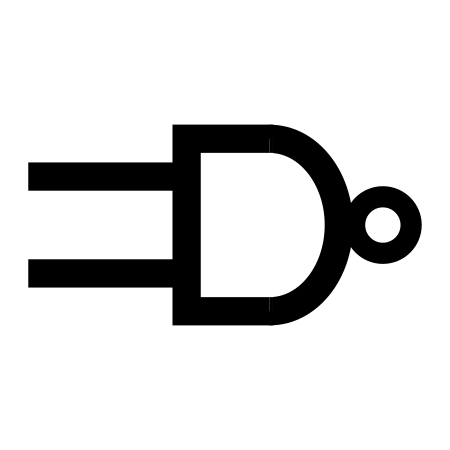

    

<b>N</b> ot\
<b>A</b> \
<b>N</b> and-powered\
<b>D</b> evice\
\
is an emulated full stack computer architecture. Based on the Jack-VM-Hack platform specified in [The Elements of Computing Systems: Building a Modern Computer from First Principles](https://www.amazon.com/Elements-Computing-Systems-Building-Principles/dp/0262640686/ref=ed_oe_p), NAND is a learning project for me to understand how computers work.
